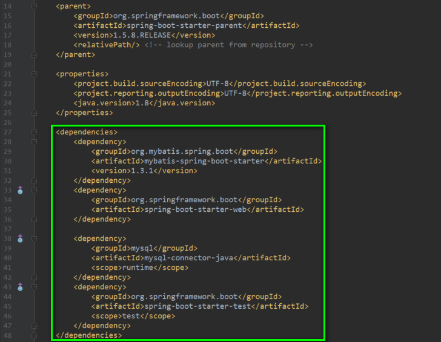

#### Spring Boot 整合MyBatis & MyBatis Generator

> 每次使用SpringBoot项目搭建MyBatis项目的时候，防止每次都去找资料来配置MyBatis自动生成配置文件等信息，这里给自己的知识库里面，增加一个模板的工程，方便以后快速开发。

##### 1.首先创建一个Spring Boot项目


##### 2.添加MyBatis的Pom依赖
(略.) 具体请查看文件 [Pom.mxl](./pom.xml)


##### 3.配置MyBatis Generator 插件

```xml
<plugin>
    <groupId>org.mybatis.generator</groupId>
    <artifactId>mybatis-generator-maven-plugin</artifactId>
    <version>1.3.5</version>
    <dependencies>
        <dependency>
            <groupId>mysql</groupId>
            <artifactId>mysql-connector-java</artifactId>
            <version>5.1.39</version>
        </dependency>
        <dependency>
            <groupId>org.mybatis.generator</groupId>
            <artifactId>mybatis-generator-core</artifactId>
            <version>1.3.5</version>
        </dependency>
    </dependencies>
    <executions>
        <execution>
            <id>Generate MyBatis Artifacts</id>
            <phase>package</phase>
            <goals>
                <goal>generate</goal>
            </goals>
        </execution>
    </executions>
    <configuration>
        <!--允许移动生成的文件 -->
        <verbose>true</verbose>
        <!-- 是否覆盖 -->
        <overwrite>true</overwrite>
        <!-- 自动生成的配置 -->
        <configurationFile>
            ${basedir}/src/main/resources/generator/mybatis-generator.xml
        </configurationFile>
    </configuration>
</plugin>
```

##### 4.添加MyBatis Generator 配置文件
* 项目的初始化结构


* 配置文件五部分


* MyBatis Generator Config 具体配置文件
```xml
<?xml version="1.0" encoding="UTF-8" ?>
<!DOCTYPE generatorConfiguration PUBLIC "-//mybatis.org//DTD MyBatis Generator Configuration 1.0//EN"
        "http://mybatis.org/dtd/mybatis-generator-config_1_0.dtd">
<generatorConfiguration>
    <context id="DB2Tables" targetRuntime="MyBatis3">

        <commentGenerator>
            <property name="suppressAllComments" value="true"/>
        </commentGenerator>

        <!-- 1.数据库链接URL、用户名、密码 -->
        <jdbcConnection driverClass="com.mysql.jdbc.Driver"
                        connectionURL="jdbc:mysql://localhost:3306/mybatis-template?characterEncoding=utf8" userId="root"
                        password="root">
        </jdbcConnection>
        <javaTypeResolver>
            <property name="forceBigDecimals" value="false"/>
        </javaTypeResolver>

        <!-- 2.生成模型的包名和位置 -->
        <javaModelGenerator targetPackage="com.jhon.rain.entity" targetProject="E:\IdeaWork\Rain-MyBatis-Template\src\main\java">
            <property name="enableSubPackages" value="true"/>
            <property name="trimStrings" value="true"/>
        </javaModelGenerator>

        <!-- 3.生成的映射文件包名和位置【xml】 -->
        <sqlMapGenerator targetPackage="mapper" targetProject="E:\IdeaWork\Rain-MyBatis-Template\src\main\resources">
            <property name="enableSubPackages" value="true"/>
        </sqlMapGenerator>

        <!-- 4.生成DAO的包名和位置 XML -->
        <!-- 客户端代码，生成易于使用的针对Model对象和XML配置文件 的代码
                type="ANNOTATEDMAPPER",生成Java Model 和基于注解的Mapper对象
                type="MIXEDMAPPER",生成基于注解的Java Model 和相应的Mapper对象
                type="XMLMAPPER",生成SQLMap XML文件和独立的Mapper接口
        -->
        <javaClientGenerator type="XMLMAPPER" targetPackage="com.jhon.rain.mapper" targetProject="E:\IdeaWork\Rain-MyBatis-Template\src\main\java">
            <property name="enableSubPackages" value="true"/>
        </javaClientGenerator>

        <!-- 5.要生成那些表(更改tableName和domainObjectName就可以) -->
        <table tableName="sys_user" domainObjectName="SysUser" enableCountByExample="false"
               enableUpdateByExample="false" enableDeleteByExample="false" enableSelectByExample="false"
               selectByExampleQueryId="false"/>
        <table tableName="sys_dept" domainObjectName="SysDept" enableCountByExample="false"
               enableUpdateByExample="false" enableDeleteByExample="false" enableSelectByExample="false"
               selectByExampleQueryId="false"/>
        <table tableName="sys_acl" domainObjectName="SysAcl" enableCountByExample="false" enableUpdateByExample="false"
               enableDeleteByExample="false" enableSelectByExample="false" selectByExampleQueryId="false"/>
        <table tableName="sys_acl_module" domainObjectName="SysAclModule" enableCountByExample="false"
               enableUpdateByExample="false" enableDeleteByExample="false" enableSelectByExample="false"
               selectByExampleQueryId="false"/>
        <table tableName="sys_role" domainObjectName="SysRole" enableCountByExample="false"
               enableUpdateByExample="false" enableDeleteByExample="false" enableSelectByExample="false"
               selectByExampleQueryId="false"/>
        <table tableName="sys_role_acl" domainObjectName="SysRoleAcl" enableCountByExample="false"
               enableUpdateByExample="false" enableDeleteByExample="false" enableSelectByExample="false"
               selectByExampleQueryId="false"/>
        <table tableName="sys_role_user" domainObjectName="SysRoleUser" enableCountByExample="false"
               enableUpdateByExample="false" enableDeleteByExample="false" enableSelectByExample="false"
               selectByExampleQueryId="false"/>
        <table tableName="sys_log" domainObjectName="SysLog" enableCountByExample="false" enableUpdateByExample="false"
               enableDeleteByExample="false" enableSelectByExample="false" selectByExampleQueryId="false"/>
    </context>
</generatorConfiguration>
```
##### 5.运行MyBatis Generator插件
* 运行 mybatis-generator:generator 命令


* 运行日志


* 项目文件结构


##### 结束语
　　反复总结用过的东西，形成一个小型的知识库，方便后面自己的学习和理解！

　　2017-11-14 